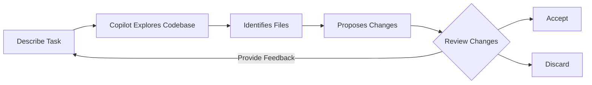

## Step 3: Getting work done even _faster_ with Copilot Agent Mode

In our previous steps, we used features of Copilot that require more hands-on guidance and they produced mostly localized results. Now, we will explore Copilot **Agent Mode**, a feature that allows Copilot to work autonomously across your entire codebase.

### 📖 Theory: Copilot Agent Mode

Copilot **Edit Mode** and **Agent Mode** both let you apply **natural‑language** driven changes across **multiple files**, however there are some differences between them.

In this step we will focus on **Agent Mode**, which is perfect for exploratory tasks where you want Copilot to autonomously figure out what needs to change.

Agent Mode is best used for **open-ended** tasks where Copilot should **explore and discover** the needed changes across your codebase.

#### Edit Mode vs Agent Mode (at a glance)

| Aspect         | ✏️ Edit Mode                      | 👩‍🚀 Agent Mode                                                                    |
| -------------- | --------------------------------- | -------------------------------------------------------------------------------- |
| Context scope  | Only the files you explicitly add | May read/add additional files & surfaces as needed                               |
| Self‑review    | Minimal (you drive iteration)     | Built‑in feedback & retry loop on errors/failures                                |
| Change scope   | Highly scoped & surgical          | Broader; may touch related layers for consistency                                |
| When to choose | You know exactly what to change   | Goal is broader or uncertain; requires exploration                               |
| Tool calling   | None (you run commands manually)  | Can invoke tools (read/edit files, run commands, inspect terminal & test output) |


#### How Agent Mode works



1. **Describe Task**: Tell Copilot what you want to accomplish in natural language.
1. **Autonomous Exploration**: Copilot explores your codebase to understand the context.
1. **Smart Discovery**: Copilot identifies which files need changes without you specifying them.
1. **Review Changes**: See proposed changes across multiple files.
1. **Accept or Discard**: Review each suggested edit and choose which to keep.
1. **Iterate**: If needed, provide follow-up instructions to refine the changes.

### :keyboard: Activity: Use Copilot Agent Mode to add a new feature! :rocket:

Our website lists activities, but it's keeping the guest list secret 🤫 

Let's use Copilot Agent Mode to change the website to display signed up students under each activity!

1. At the bottom of Copilot Chat window, use the dropdown to switch to **Agent** mode.

   

1. **Don't** add any files to context! Agent mode will explore and find the relevant files automatically.

   > 💡 **Tip:** Agent mode works best when you let Copilot discover what needs to change. You can still use the **Add Context...** button if you want to provide additional context like a GitHub issue or specific guidelines, but file discovery is handled automatically.

1. Ask Copilot to update our project to display the current participants of activities. Wait for Copilot to explore your codebase and propose changes.

   > 
   >
   > ```prompt
   > Hey Copilot, can you please update the activity cards to add a participants section?
   > It should show the participants that are already signed up for that activity as a bulleted list.
   > Remember to make it pretty!
   > ```

   - Watch as Copilot explores your codebase and identifies which files need to be modified.
   - Copilot will show you its thought process and which files it's examining.
   - A suggested edits panel will appear in the bottom right of the editor window providing controls to jump to the recommended changes.

      

1. Before we simply accept the changes, please check our website again and verify everything is updated as expected. Here is an example of an updated activity card. You may need to restart the app or refresh the page.

   

   > 🪧 **Note:** Your activity card may look different. Copilot won't always produce the same results. Also notice that Copilot Agent mode may have modified different files than you expected - that's the power of autonomous exploration!

   <details>
   <summary>Need help? 🤷</summary><br/>
   If the website is not loading, here are some things to check.

   - Restart the VS Code Debugger to make sure the latest version of the website is served.
   - If you forgot the url, or closed the window, please review step 1.
   - Try hard refreshing the webpage or opening in a private window so it downloads a fresh copy.

   </details>

1. Now that we have confirmed our changes are good, use the panel to cycle through each suggested edit and press **Keep** to apply the change.

   > 💡 **Tip:** Agent mode might have found and modified files you didn't expect. Review all changes carefully to understand what Copilot discovered and changed.

1. With our new feature complete, please **commit** and **push** the changes to GitHub.

1. Wait a moment for Mona to check your work, provide feedback, and share the next lesson.


<details>
<summary>Having trouble? 🤷</summary><br/>

If you don't get feedback, here are some things to check:

- Make sure your commit the changes in the `client-app/src/` directory to the branch `accelerate-with-copilot` and pushed/synchronized to GitHub.
- If Mona found a mistake, simply make a correction and push your changes again. Mona will check your work as many times as needed.

</details>
